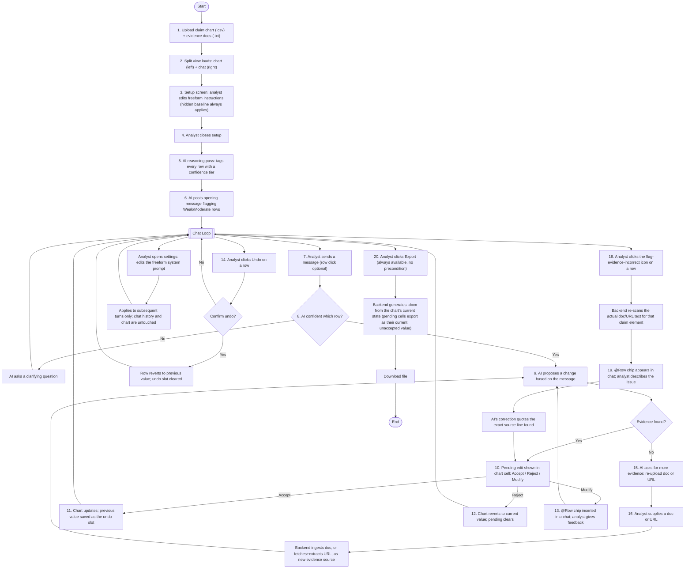

# Lumenci Assistant — User Flow Diagram

Derived from the locked steps in `user-flow-steps.md`. Covers the main path (upload → setup → initial tagging → chat refinement loop → export) plus all edge-case branches (no evidence found, flagged-incorrect evidence, undo, mid-session system-prompt edit), each re-entering the central chat loop rather than dead-ending.

