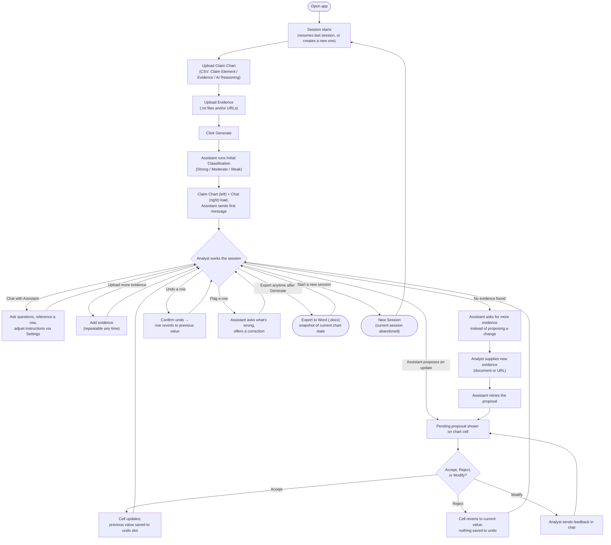

# User Flow Diagram

> Visual companion to [user-flow-steps-rough-updated.md](./user-flow-steps-rough-updated.md). **Assistant** = the Qwen model.

## Reading the diagram

- The **Analyst works the session** diamond is the hub — chat, chart edits, evidence uploads, undo, flagging, and export can all happen in any order, any number of times, once the chart is generated.
- **Accept / Reject / Modify** is the only cycle with a hard rule: every proposal (first or revised) needs an explicit Accept before it touches the chart.
- **No evidence found** is the one edge case that loops back into the main proposal flow rather than ending the session — new evidence leads the Assistant to retry.
